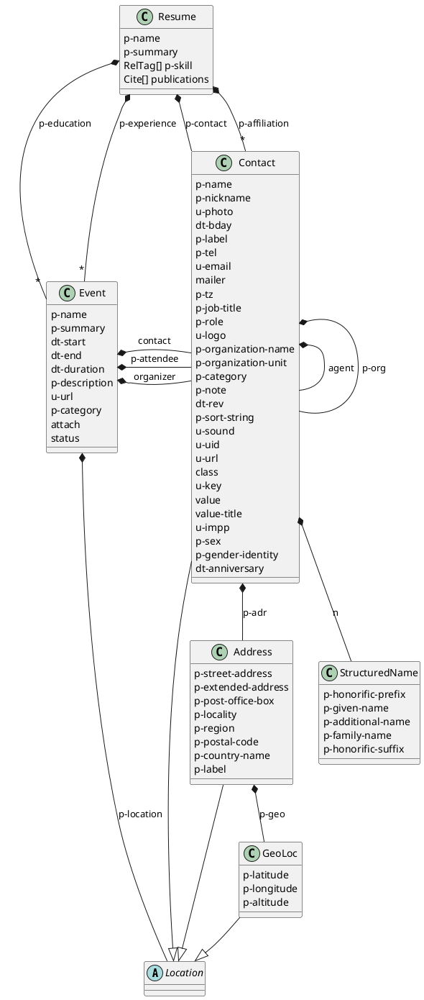

---
---
# Overview of microformats2 content model

The content model is based on microformats v2. The spec advises using both v2 [h-resume] and v1 [hResume] class-names. So I've combined them in the following presentations:

- [Resume]() content model
- [Contact]() content model
- [Location]() content model
- [Event]() content model

## Class diagram





[h-resume]: http://microformats.org/wiki/h-resume "h-resume v2 microformat"
[hResume]: http://microformats.org/wiki/hResume "hResume v1 microformat"
