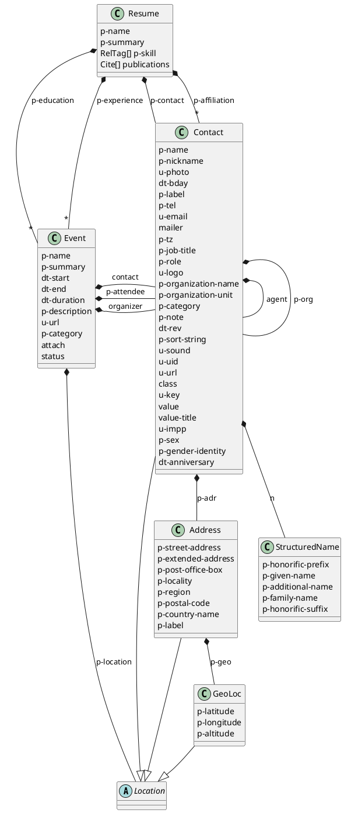



```plantuml
@startuml
abstract class Location {
}
class Address {
  p-street-address
  p-extended-address
  p-post-office-box
  p-locality
  p-region
  p-postal-code
  p-country-name
  p-label
}
Address --|> Location
Address *-- GeoLoc: p-geo
class GeoLoc {
  p-latitude
  p-longitude
  p-altitude
}
GeoLoc --|> Location
class StructuredName {
  p-honorific-prefix
  p-given-name
  p-additional-name
  p-family-name
  p-honorific-suffix
}
class Contact {
  p-name
  p-nickname
  u-photo
  dt-bday
  p-label
  p-tel
  u-email
  mailer
  p-tz
  p-job-title
  p-role
  u-logo
  p-organization-name
  p-organization-unit
  p-category
  p-note
  dt-rev
  p-sort-string
  u-sound
  u-uid
  u-url
  class
  u-key
  value
  value-title
  u-impp
  p-sex
  p-gender-identity
  dt-anniversary
}
Contact --|> Location
Contact *-- StructuredName: n
Contact *-- Address: p-adr
Contact *-- Contact: agent
Contact *-- Contact: p-org
class Event {
  p-name
  p-summary
  dt-start
  dt-end
  dt-duration
  p-description
  u-url
  p-category
  attach
  status
}
Event *- Location: p-location
Event *- Contact: p-attendee
Event *- Contact: contact
Event *- Contact: organizer
class Resume {
  p-name
  p-summary
  RelTag[] p-skill
  Cite[] publications
}
Resume *-- Contact: p-contact
Resume *-- "*" Event: p-education
Resume *-- "*" Event: p-experience
Resume *-- "*" Contact: p-affiliation
@enduml
```

