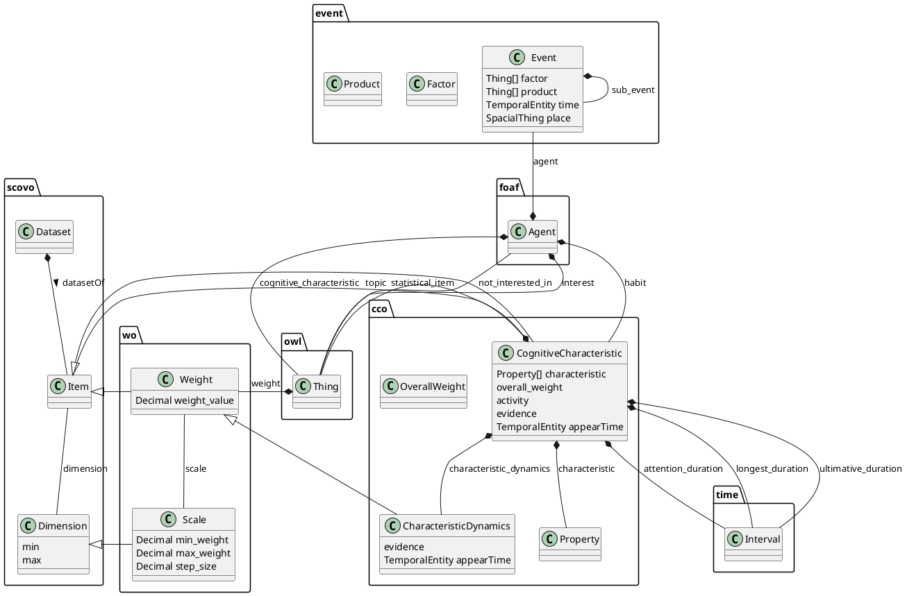

---
---


```plantuml
@startuml
package owl {
  class Thing
}
package time {
  class Interval
}
package foaf {
  class Agent
  Agent *-- Thing: cognitive_characteristic
  Agent -- Thing: not_interested_in
  Agent *-- Thing: interest
}
package event {
  class Event {
    Thing[] factor
    Thing[] product
    TemporalEntity time
    SpacialThing place
  }
  Event --* Agent: agent
  Event *-- Event: sub_event
  class Factor
  class Product
}
package scovo {
  class Dataset
  Dataset *-- Item: datasetOf >
  class Dimension {
    min
    max
  }
  class Item
  Item -- Dimension: dimension
}
package wo {
  class Scale {
    Decimal min_weight
    Decimal max_weight
    Decimal step_size
  }
  Dimension <|- Scale
  class Weight {
    Decimal weight_value
  }
  Item <|- Weight
  Weight -- Scale: scale
  Thing *-- Weight: weight
}
package cco {
  class CognitiveCharacteristic {
    Property[] characteristic
    overall_weight
    activity
    evidence
    TemporalEntity appearTime
  }
  Agent *-- CognitiveCharacteristic: habit
  CognitiveCharacteristic *-- Property: characteristic
  CognitiveCharacteristic *-- CharacteristicDynamics: characteristic_dynamics
  CognitiveCharacteristic *-- Item: statistical_item
  CognitiveCharacteristic -- Thing: topic
  CognitiveCharacteristic *-- Interval: attention_duration
  CognitiveCharacteristic *-- Interval: longest_duration
  CognitiveCharacteristic *-- Interval: ultimative_duration
  Item <|-- CognitiveCharacteristic
  class CharacteristicDynamics {
    evidence
    TemporalEntity appearTime
  }
  Weight <|-- CharacteristicDynamics
  class OverallWeight
}
@enduml
```

