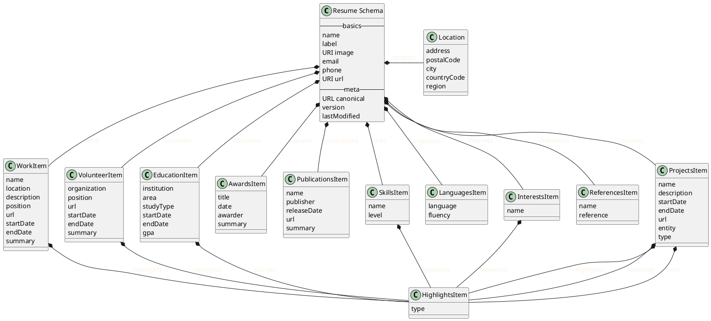

---
---



```plantuml
@startuml
skinparam ArrowFontColor Linen
class "Resume Schema" as Resume {
  -- basics --
  name
  label
  URI image
  email
  phone
  URI url
  -- meta --
  URL canonical
  version
  lastModified
}
Resume *- Location: location
Resume *-- WorkItem: work
Resume *-- VolunteerItem: volunteer
Resume *-- EducationItem: education
Resume *-- AwardsItem: awards
Resume *-- PublicationsItem: publications
Resume *-- SkillsItem: skills
Resume *-- LanguagesItem: languages
Resume *-- InterestsItem: interests
Resume *-- ReferencesItem: references
Resume *-- ProjectsItem: projects
class Location {
  address
  postalCode
  city
  countryCode
  region
}
class WorkItem {
  name
  location
  description
  position
  url
  startDate
  endDate
  summary
}
WorkItem *-- HighlightsItem: highlights
class VolunteerItem {
  organization
  position
  url
  startDate
  endDate
  summary
}
VolunteerItem *-- HighlightsItem: highlights
class EducationItem {
  institution
  area
  studyType
  startDate
  endDate
  gpa
}
EducationItem *-- HighlightsItem: courses
class AwardsItem {
  title
  date
  awarder
  summary
}
class PublicationsItem {
  name
  publisher
  releaseDate
  url
  summary
}
class SkillsItem {
  name
  level
}
SkillsItem *-- HighlightsItem: keywords
class LanguagesItem {
  language
  fluency
}
class InterestsItem {
  name
}
InterestsItem *-- HighlightsItem: keywords
class ReferencesItem {
  name
  reference
}
class ProjectsItem {
  name
  description
  startDate
  endDate
  url
  entity
  type
}
ProjectsItem *-- HighlightsItem: highlights
ProjectsItem *-- HighlightsItem: keywords
ProjectsItem *-- HighlightsItem: roles
class HighlightsItem {
  type
}
@enduml
```

